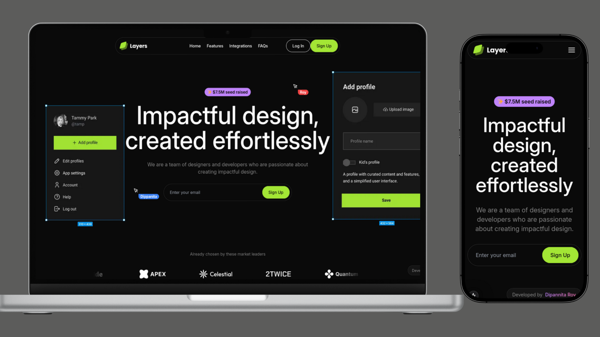

# SAAS Landing Page

[Live Demo](https://saas-landing-page-six-xi.vercel.app/)

A modern, responsive SAAS landing page built with [Next.js](https://nextjs.org) and animated using [GSAP](https://greensock.com/gsap/).

## Screenshots



## Features

- **Responsive Design**: Seamless experience across devices.
- **Next.js Optimization**: Fast loading and SEO benefits.
- **GSAP Animations**: Engaging, dynamic animations.

## Getting Started

Clone the repository and install dependencies:

```bash
git clone https://github.com/yourusername/saas-landing-page.git
cd saas-landing-page
npm install
```

Run the development server:

```bash
npm run dev
```

Visit [http://localhost:3000](http://localhost:3000) to view.

## Deployment

Deploy easily with [Vercel](https://vercel.com/new?utm_medium=default-template&filter=next.js&utm_source=create-next-app&utm_campaign=create-next-app-readme).

## Acknowledgments

Developed by **Dipannita Roy**. Inspired by modern SAAS designs.

Contributions and feedback are welcome!
